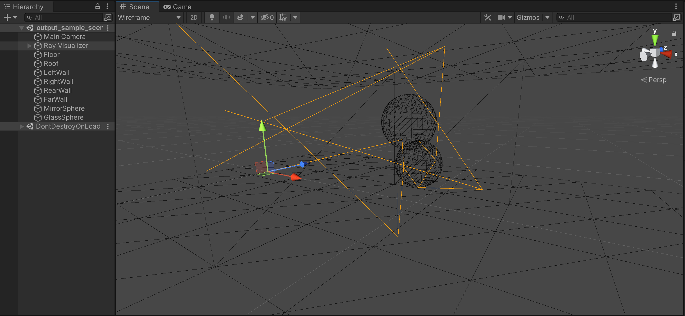

# COMP30019 Graphics and Interaction 2021 Semester 2 Project 1 introspection GUI
In this semester, we build a ray tracer program for Project 1.
I found the troubleshooting process to be rather opaque, and I would like to look at something other than
just floating-point numbers in a console or in the debugger variables window.
This Unity project consumes and visualizes ray trace recordings generated with my other project at https://github.com/shangzhel/RayTracer.Debug.

## Usage:
Clone this repository to start with:
```
git clone https://github.com/shangzhel/RayTracer.Debug.Gui.git
```

This project has a simple structure.

A component script called **Ray Visualizer** is provided and it is responsible for creating representations of rays to be visualized.
It has three properties: **Asset**, **Ray Prefab**, and **Ray Pool**.


- The **Asset** property specifies which set of recordings to visualize. See [Rays assets](#rays-assets).
- The **Ray Prefab** property specifies the template to represent rays with.
  The project provides a default ray prefab, so you only need to create one if you want something different.
- The **Ray Pool** property specifies how many ray representations to create.
  You may want to increase it if you are visualizing very large amounts of rays.

The GameObject that the component is attached to should be located at world origin, have no world rotation,
and have world scale set to identity for the ray representations to be drawn accurately.

The control GUI has several settings.


- **Items per page** controls how many entries of recorded rays show on screen at one time.
  Increase it if you have a large display and can show a longer list.
- **Page** controls which page of the rays are shown.
  There are easily hundreds of thousands of rays, so pagination is necessary.
  The buttons underneath switch pages.
- The next box tells you which ray is currently selected.
- **Select hierarchy** controls whether groups of rays are selected at once according to a hierarchical scheme (see [Ray identifier convention](#ray-identifier-convention)), or one at a time.
- The rest are ray identifiers. Whatever integer arrays you recorded with each ray are displayed here.
  If **Select hierarchy** is checked, then whichever rays have an `*` in front of their identifier means they are also visible in the scene by hierarchy.

In addition, keyboard controls are also available.
Pressing the left and right arrow keys goes to the previous and next page respectively.
Pressing the up and down arrow keys select the previous and next group of rays to visualize respectively.
The keys can be held to fire once per frame, so that you can quickly go through pages and rays to find the ones that look incorrect.

In a scene, you may want to place meshes that correspond to your scene file so that you can visually confirm your rays.
You can switch the Scene Shading Mode to Wireframe and select the GameObject with the **Ray Visualizer** component attached
to highlight the ray representations.



An empty scene is provided at [Assets/Scenes/Output.scene](Assets/Scenes/Output.scene).

The code that implements all of the above is lifted into an embedded package, which you can find in [Packages/shangzhel.RayTracer.Debug.Gui](Packages/shangzhel.RayTracer.Debug.Gui).
You may customize it in any way you like if the features it provides is insufficient.
Pull requests are welcome, but I will probably not deal with them until after the semester.
- This embedded package is reusable such that if you so wish, you may copy it into whatever project of yours.

### Rays assets
This project comes with an asset importer that understands the recordings generated by the [introspection library](https://github.com/shangzhel/RayTracer.Debug).
To activate it, give your ray recordings a `.rays` file extension, and copy it into somewhere in the [Assets](Assets) folder.
In the Unity Editor, it gets imported as a **Rays Asset**, to be used with the **Ray Visualizer** component.


### Ray identifier convention
Although my [introspection library](https://github.com/shangzhel/RayTracer.Debug) does not specify what format rays are identified by,
this visualizer does.
The visualizer defines a hierarchy by prefix naming.

For example, a ray identified by `[1,2]` is considered an ancestor of `[1,2,0]`, `[1,2,1]`, and `[1,2,1,0]` because all three begin with `[1,2]`. Conversely, `[1,3,0]` is not a descendant of `[1,2]` because it does not begin with `[1,2]`.

Use this naming convention to have the visualizer group rays together and visualize them at once.
This is useful for showing indirect reflection and refraction rays.
